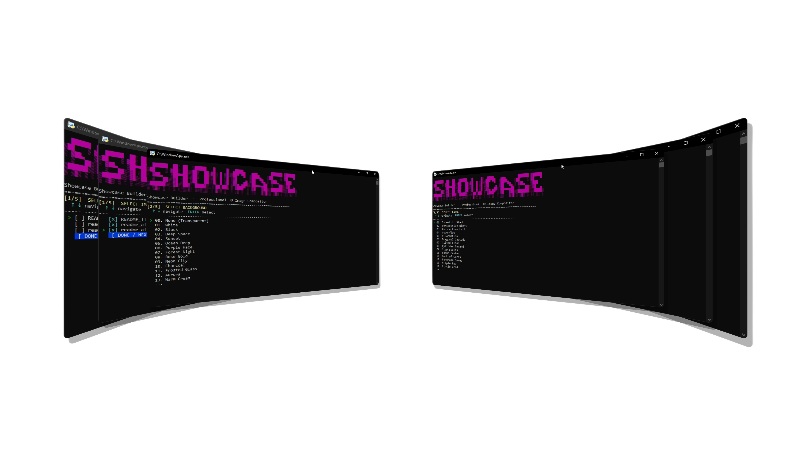
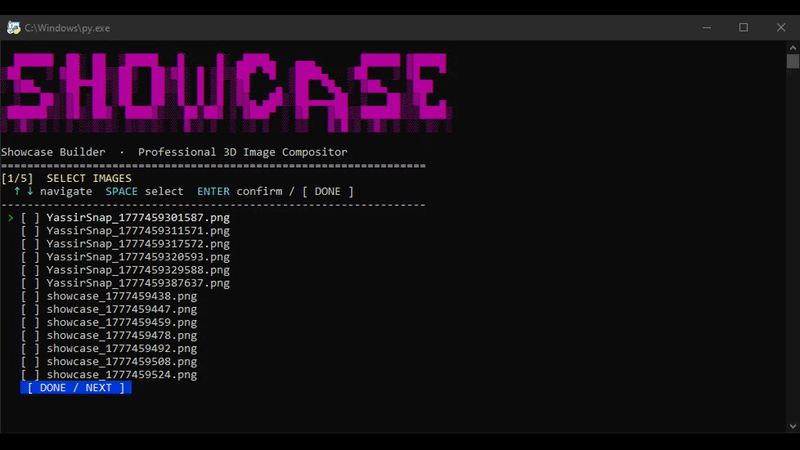
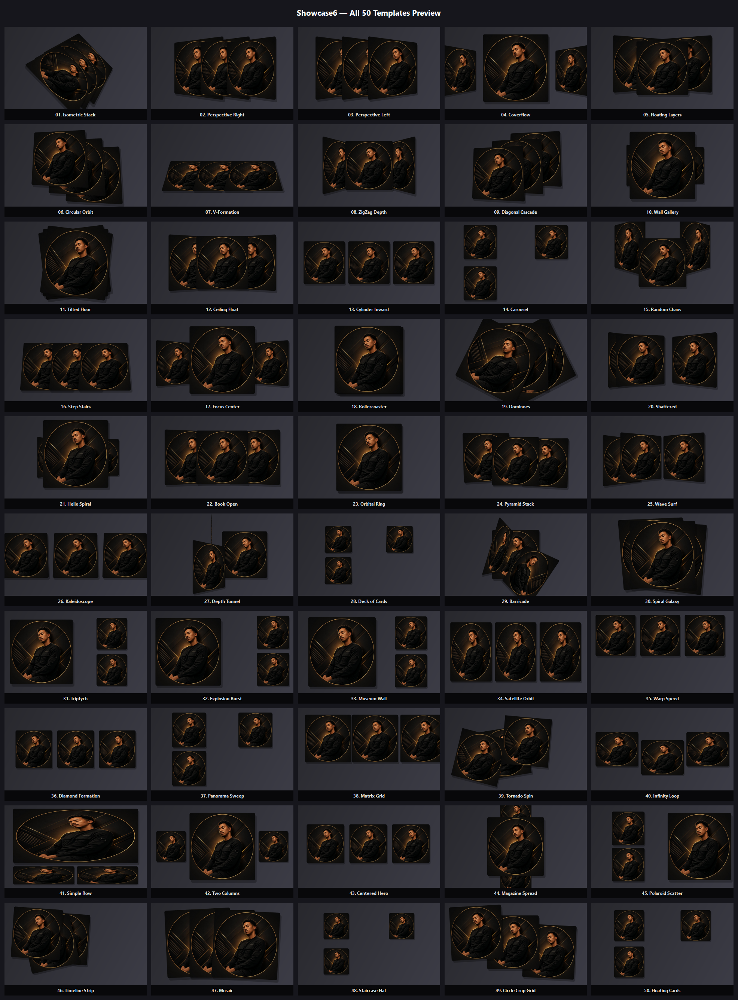
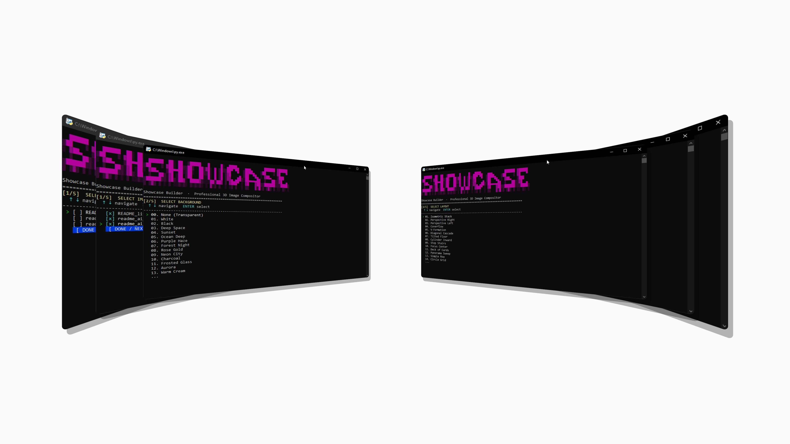
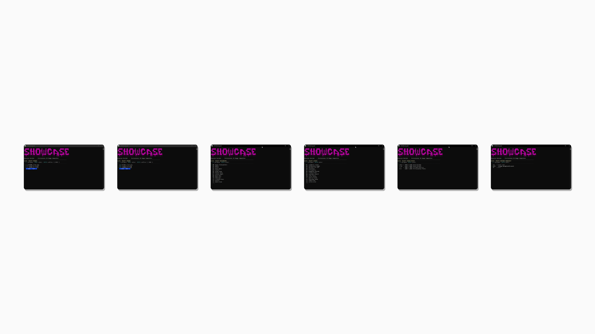
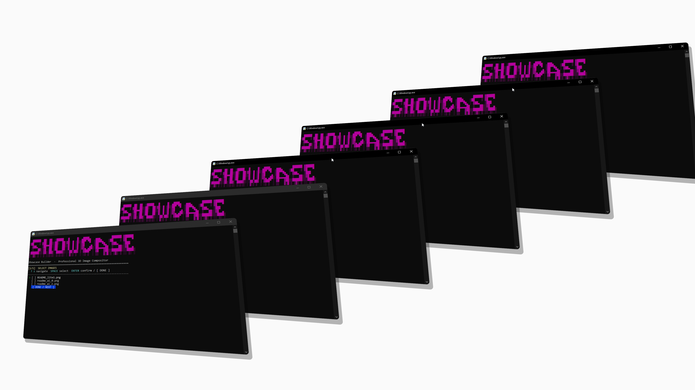
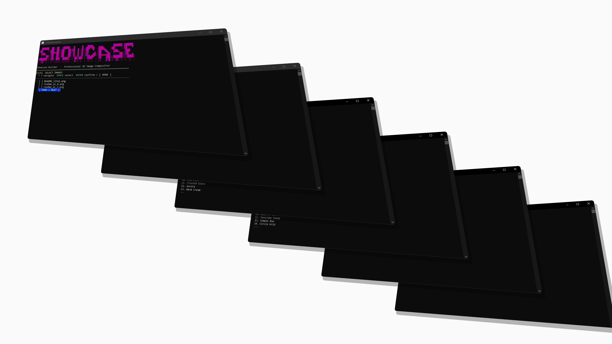

<p align="center">
  
  <h1 align="center">Showcase</h1>
</p>


> **[للانتقال الى النسخة العربية اضغط هنا ](#العربية)**

---

## English

**Showcase6** is a professional CLI tool that transforms your 2D images and GIFs into stunning **3D mockups and showcase scenes** — directly from your terminal, with no GUI required.





### ✨ Features
- **50 Templates:** 20 classic 3D, 20 professional 3D, 10 flat/clean layouts
- **17 Backgrounds:** White, Black, Deep Space, Sunset, Ocean, Aurora, Neon City, and more — plus **None (Transparent)**
- **3D GIF Support:** Animated GIFs are rendered frame-by-frame in 3D and re-exported as animated GIFs
- **High-Quality Rendering:** PySide6-powered engine with antialiasing, rounded corners, and drop shadows
- **4 Canvas Ratios:** 16:9, 9:16, 1:1, 4:3
- **Interactive CLI:** Navigate with arrow keys, select with SPACE/ENTER

### 📦 Installation

```bash
pip install showcase6
```

Or install from source:

```bash
git clone https://github.com/YASSER-27/showcase6.git
cd showcase6
pip install .
pip install -r requirements.txt
```

### 🛠️ Requirements

```
PySide6>=6.5.0
imageio>=2.31.0
numpy>=1.24.0
```

### 🚀 How to Use

1. **Open your terminal** in the folder containing your images or GIFs.
2. **Run the command:**

```bash
showcase
# or directly:
python show.py
```

3. **Follow the 4-phase interactive menu:**

| Phase | What you choose |
|-------|----------------|
| SCAN | Select one or more images / GIFs |
| BACKGROUND | Pick a background style (or None) |
| TEMPLATE | Pick a 3D/flat layout (1–50) |
| CANVAS | Choose output resolution ratio |

4. The result is **automatically exported and opened** in your default viewer.

### 📂 Supported Formats
`.png` `.jpg` `.jpeg` `.webp` `.bmp` `.gif`

### 🏗️ Build Executable

```bash
pip install pyinstaller
pyinstaller showcase.spec
```

The executable will be in `dist/showcase.exe`.

**All Templates**



| Image | Image |
|---|---|
|  |  |
|  |  |


<a name="العربية"></a>

## العربية 🌐

**Showcase6** هي أداة CLI احترافية تحوّل صورك العادية وملفات GIF إلى **مشاهد عرض ثلاثية الأبعاد** مذهلة — مباشرةً من سطر الأوامر، دون الحاجة إلى أي واجهة رسومية.

### ✨ المميزات
- **50 قالب:** 20 ثلاثي الأبعاد كلاسيكي، 20 ثلاثي الأبعاد احترافي، 10 قوالب مسطحة/نظيفة
- **17 خلفية:** أبيض، أسود، فضاء عميق، غروب، محيط، أورورا، مدينة النيون، وأكثر — بالإضافة إلى **بلا خلفية (شفاف)**
- **دعم GIF المتحرك:** يتم تحويل كل إطار من الـ GIF إلى 3D ثم إعادة تصديره كـ GIF متحرك
- **جودة عالية:** محرك رسم PySide6 مع مضاد التشويه، زوايا مدورة، وظلال ناعمة
- **4 أبعاد لتنسيق الصورة:** 16:9، 9:16، 1:1، 4:3
- **واجهة تفاعلية:** التنقل بأسهم الكيبورد، التحديد بـ SPACE/ENTER

### 📦 التثبيت

```bash
pip install showcase6
```

أو التثبيت من المصدر:

```bash
git clone https://github.com/yourname/showcase6.git
cd showcase6
pip install -r requirements.txt
python show.py
```

### 🛠️ المتطلبات

```
PySide6>=6.5.0
imageio>=2.31.0
numpy>=1.24.0
```

### 🚀 طريقة الاستخدام

1. **افتح الطرفية (Terminal)** داخل المجلد الذي يحتوي على صورك أو ملفات الـ GIF.
2. **شغّل الأمر:**

```bash
showcase
# أو مباشرةً:
python show.py
```

3. **اتبع القائمة التفاعلية ذات المراحل الأربع:**

| المرحلة | ماذا تختار |
|---------|-----------|
|المسح | اختر صورة أو أكثر / ملفات GIF |
|الخلفية | اختر نمط الخلفية (أو بلا خلفية) |
|القالب | اختر قالب 3D أو مسطح (1–50) |
|القماش | اختر نسبة أبعاد الإخراج |

4. النتيجة يتم **تصديرها وفتحها تلقائياً** في المعاينة الافتراضية.

### 📂 الصيغ المدعومة
`.png` `.jpg` `.jpeg` `.webp` `.bmp` `.gif`

### 🏗️ بناء ملف تنفيذي

```bash
pip install pyinstaller
pyinstaller showcase.spec
```

الملف التنفيذي سيكون في `dist/showcase.exe`.

### 📄 الرخصة
MIT License
